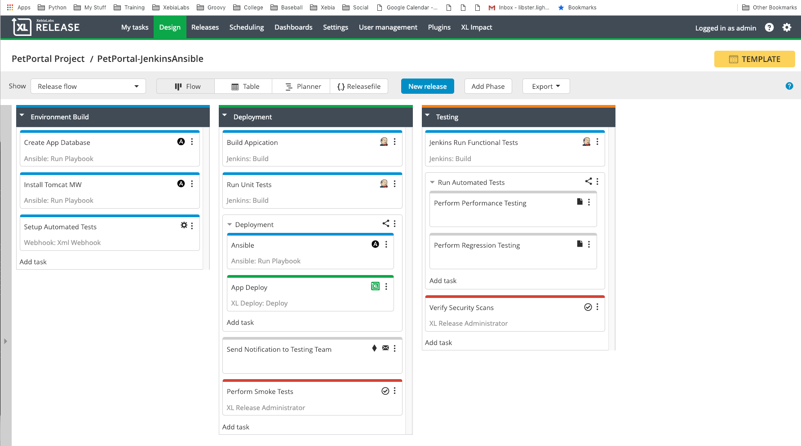
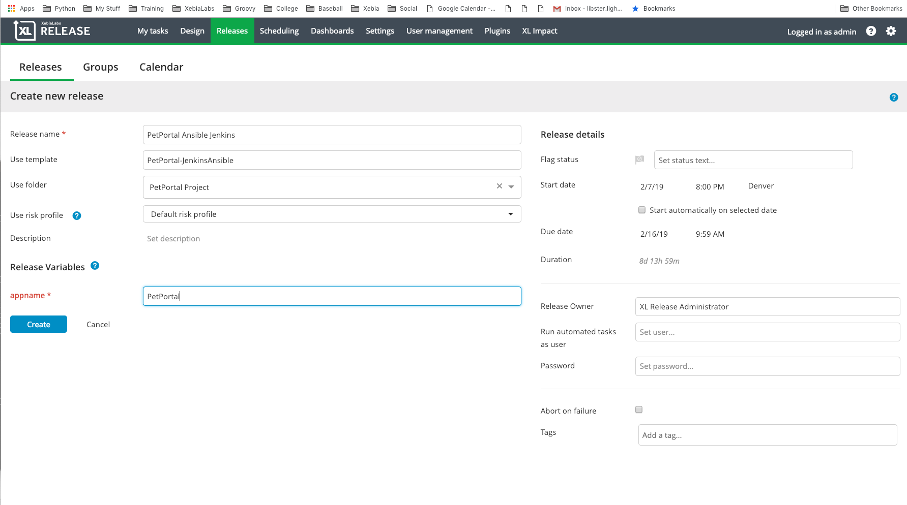

# 
# PetPortal Ansible-Jenkins

This is my Pet Portal which uses Ansible to provision the targeted environemnt and Jenkins to Build and Test the
 applicaion.  This blueprint also leverages the xlr-xlrelease-plugin to dynamically tag the releases with the 
 Service Now tickets.

## Setup Steps
1. Clone this repository
2. Configure your ~/.xebialabs/config.yaml for your connection to the XL platform tools
```
    xl-deploy:
      username: admin
      password: admin
      url: http://localhost:4516/
    xl-release:
      username: admin
      password: admin
      url: http://localhost:5516/
    blueprint-repository:
      username: ""
      password: ""
      # file:// protocol is not supportted so you'll need to run a local http server
      # E.g. in blueprint directory run: python -m SimpleHTTPServer 3516
      url: ttp://localhost:3516
```
_3. Create the Blueprints

```
| => xl --config config.yaml blueprint  
? Choose a blueprint: jenkins-ansible  
? What is the XL Release folder name? PetPortal Project  
? What is the Ansible Host name? ansible  
? What is the Jenkins server name? Jenkins  
? Confirm to generate blueprint files? (Y/n)   
```

_4. Create a docker-compose.yaml file **from contents at the bottom of this page** and run it to create a demo environment
```
| => docker-compose up --build
```

_5. Apply the blueprint to the XL platform, in this case it will create a XL Release template to demonstrate the pipeline
```
| => xl --config ./config.yaml apply -f ./xebialabs/xlr-pipeline.yaml  
```
_6. Navigate to XL Release and start a release from the new template  
  



## Docker Compose

Use this docker-compose.yaml file to create a demo environemmt to test this blueprint
### docker-compose.yaml
```
gogs:
  image: xebialabsunsupported/docker-gogs
  ports:
    - "10022:22"
    - "10080:3000"

artifactory:
  image: xebialabsunsupported/docker-artifactory
  ports:
    - "7080:8081"

jenkins:
  image: xebialabsunsupported/docker-jenkins:2.129-alpine
  volumes:
   - /var/run/docker.sock:/var/run/docker.sock
  links:
   - xld
   - artifactory
   - gogs
   - socat
   - devregistry
   - qaregistry
  ports:
   - "8080:8080"

xld:
  image: xebialabsunsupported/docker-xld:8.5.2-alpha26
  volumes:
   - ~/xl-licenses:/license
   - ./initialize/Datical-2.0.0.dar:/opt/xebialabs/xl-deploy-server/importablePackages/Datical-2.0.0.dar
   - ./initialize/hammer:/opt/xebialabs/hammer
  links:
   - mysql1
   - artifactory
   - socat
   - devregistry
   - qaregistry
   - jboss1
   - apache1
   - ansible1
  ports:
   - "4516:4516"

xlr:
  image: xebialabsunsupported/docker-xlr:8.5.1
  volumes:
   - ~/xl-licenses:/license
   - ./initialize/downloads/xlr-delphix-plugin-2.0.0-rc.6.jar:/opt/xebialabs/xl-release-server/default-plugins/__local__/xlr-delphix-plugin-2.0.0-rc.6.jar
  links:
   - jenkins
   - xld
   - artifactory
   - gogs
   - socat
   - devregistry
   - qaregistry
   - ansible1
   - delphix
  ports:
   - "5516:5516"

socat:
  image: bobrik/socat
  ports:
    - "2376:2375"
  links:
    - devregistry
  privileged: true
  volumes:
    - /var/run/docker.sock:/var/run/docker.sock
  command: TCP4-LISTEN:2375,fork,reuseaddr UNIX-CLIENT:/var/run/docker.sock

devregistry:
  restart: always
  image: registry:latest
  ports:
    - "5000:5000"
  environment:
    REGISTRY_AUTH: htpasswd
    REGISTRY_AUTH_HTPASSWD_PATH: /certs/htpasswd
    REGISTRY_AUTH_HTPASSWD_REALM: Registry Realm
    REGISTRY_HTTP_TLS_CERTIFICATE: /certs/devregistry.crt
    REGISTRY_HTTP_TLS_KEY: /certs/devregistry.key
  volumes:
    - ../resources/xl-deploy/certs/:/certs

qaregistry:
  restart: always
  image: registry:latest
  ports:
    - "5001:5000"
  environment:
    REGISTRY_AUTH: htpasswd
    REGISTRY_AUTH_HTPASSWD_PATH: /certs/htpasswd
    REGISTRY_AUTH_HTPASSWD_REALM: Registry Realm
    REGISTRY_HTTP_TLS_CERTIFICATE: /certs/qaregistry.crt
    REGISTRY_HTTP_TLS_KEY: /certs/qaregistry.key
  volumes:
    - ../resources/xl-deploy/certs/:/certs

jboss1:
  image: xebialabsunsupported/xl-docker-demo-jboss:9.0.2.Final
  ports:
   - "9990:9990"
   - "8880:8080"

mysql1:
  image: xebialabsunsupported/xl-docker-demo-mysql:5.7.17

apache1:
  image: xebialabsunsupported/xl-docker-demo-apache:2.4.33-alpine
  links:
   - jboss1
  ports:
   - "80:80"

ansible1:
  image: xebialabsunsupported/docker-ansible-oc:latest

delphix:
  image: xebialabsunsupported/xl-docker-demo-delphix

credentials:
  image: xebialabsunsupported/xl-docker-demo-xlr-credentials-updater:latest
  volumes:
    - ~/keys:/keys
  links:
    - xlr

xld_cli:
  image: xebialabsunsupported/xl-docker-demo-xld-cli:8.2.0
  volumes:
    - ~/keys:/keys
    - ./initialize:/data
  links:
    - xld
```

