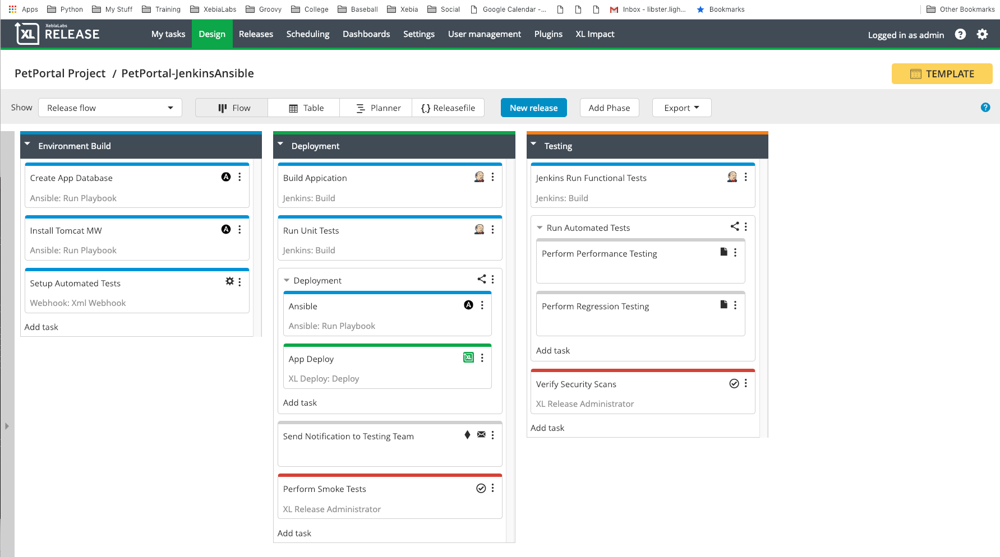
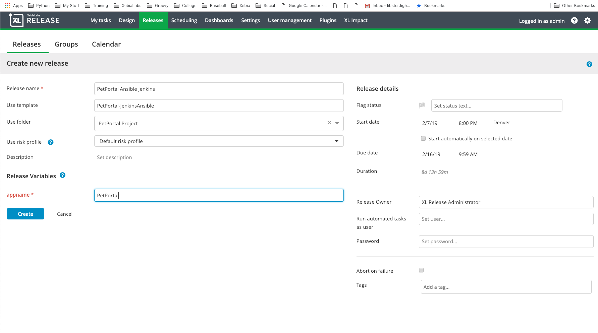

# 
# PetPortal Jenkins/Ansible

This is a Pet Portal which uses Ansible to provision the targeted environemnt and Jenkins to Build and Test the
 applicaion.  This blueprint requires that you have a Jenkins and Ansible host defined.

## Apply the blueprint to the XL platform
In this case it will create a XL Release template to demonstrate the pipeline
```
| => xl apply -f ./xebialabs/xlr-pipeline.yaml  
```
##Navigate to XL Release and start a release from the new template  
  


